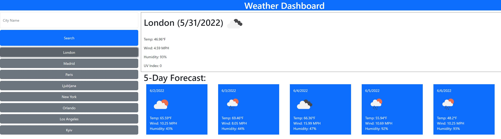

# theMostMagnificentWeatherDashboard

You are presented with a search bar and and button

when you search a city it will show current weather in the first box including temperature, wind speed, humidity and UV Index

it will also show the 5 day forcast under the top box

when you search a city it will be put in to history where you can click to see previous searched cities

live site: https://zzaclipse.github.io/theMostMagnificentWeatherDashboard/

